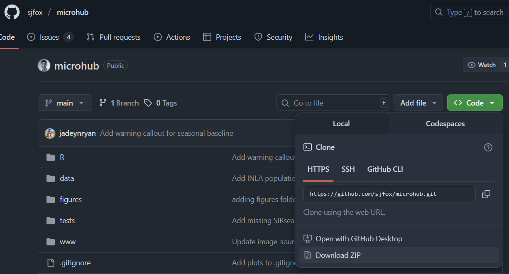
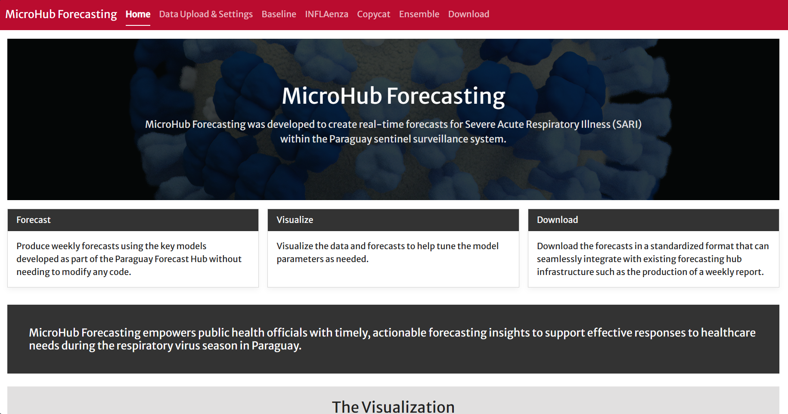

# MicroHub Forecasting Tool

## Purpose

The MicroHub Forecasting Tool was developed to create real-time forecasts for
Severe Acute Respiratory Illness (SARI) within the Paraguay sentinel
surveillance system. The tool facilitates three main tasks:

1.  Producing weekly forecasts using the key models developed as part of the
    Paraguay Forecast Hub on user-uploaded data without needing to interact
    directly with the model software,

2.  Visualizing the data and forecasts to help the user tune the model
    parameters as needed, and

3.  Downloading the forecasts in a standardized format that can seamlessly
    integrate with existing forecasting hub infrastructure such as the
    production of a weekly report.

Ultimately, the MicroHub Forecasting Tool empowers public health officials with
timely, actionable forecasting insights to support effective responses to
healthcare needs during the respiratory virus season in Paraguay.

## Installation

The MicroHub Forecasting Tool was developed as a Shiny dashboard in the R
programming language. Due to software and computational constraints, the tool is
not able to be hosted online, so users must download, run, and use the dashboard
directly on their own machines. The following provide a step-by-step guide to
get the tool up and running, assuming introductory knowledge of the R
programming language.

1.  Download and install [R and
    RStudio](https://posit.co/download/rstudio-desktop/). More in-depth
    instructions can be found in [*Hands-On Programming with
    R*](https://rstudio-education.github.io/hopr/starting.html)*.*

2.  Download the code from the [GitHub
    repository](https://github.com/sjfox/microhub) to your local machine.

    -   A .zip file of the software can be downloaded by clicking on the green
        Code button and then clicking `Download ZIP`. Once obtained you can
        unzip the folder and access all the files.

        

3.  Extract all files from the downloaded .zip file and save the entire folder
    somewhere on your machine.

4.  Open the `microhub.Rproj` file with RStudio.

5.  You will now need to install the R packages necessary to run the app on your
    machine. Open and run the `install-packages.R` script found in the `R`
    folder of the project.

    -   **Note**: R-INLA is necessary to run the INFLAenza model and is not on
        CRAN. If you run into issues with this installation, ensure your
        versions of R and INLA are compatible at
        [https://www.r-inla.org/](https://www.r-inla.org/download-install). If
        you can run the test example provided in the link, you will know INLA is
        installed properly.

6.  Open the `app.R` file using the file browser within the application and then
    click the `Run App` button within the RStudio window (depending on your
    window configuration it is likely to be in the top part of the window). Once
    clicked, you should see the MicroHub home page.

## Acknowledgements

This work would not have been possible without the close collaboration and input
from public health officials at the Paraguay Ministerio de Salud Publica y
Bienestar Social (MSPBS), the Pan American Health Organization (PAHO), the
Council for State and Territorial Epidemiologists (CSTE), and the Centers for
Disease Control and Prevention (CDC). The authors gratefully acknowledge the
hard work of [Jadey Ryan](https://jadeyryan.com/) for developing all of the
software for the MicroHub tool Shiny application and integrating the forecast
model software within. The authors additionally acknowledge the helpful comments
from the members of the CSTE, CDC, and Models of Infectious Disease Agents Study
(MIDAS) forecasting working groups. BKMC, MVS, and SJF were supported by the
CSTE contract NU38OT000297. The content is solely the responsibility of the
authors and does not necessarily represent the official views of the Paraguay
MSPBS, PAHO, CSTE, CDC, or MIDAS.

## Contact

Spencer Fox: [sjfox\@uga.edu](mailto:sjfox@uga.edu){.email}
