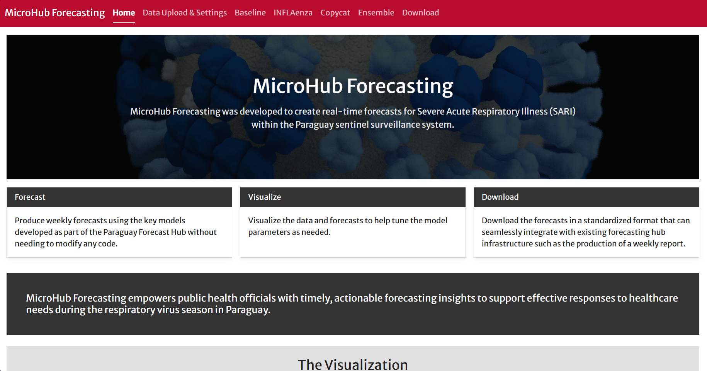

# MicroHub Forecasting Tool

## Table of Contents

-   [Purpose](#purpose)
-   [Currently Available Models](#currently-available-models)
-   [Installation](#installation)
-   [Acknowledgements](#acknowledgements)
-   [Contact](#contact)

## Purpose {#purpose}

The **MicroHub Forecasting Tool** is a general-purpose infectious disease forecasting dashboard designed to support real-time epidemic prediction within collaborative forecasting hub infrastructure. The tool allows users to upload epidemiological data and produce forecasts from established forecasting approaches that have been used across a number of seasonal infectious diseases and geographies.

The tool was originally developed to generate forecasts for Severe Acute Respiratory Illness (SARI) within the Paraguay sentinel surveillance system as part of the Paraguay Forecast Hub. Since its initial deployment, the software has been generalized to support infectious disease forecasting workflows across a wide range of pathogens, locations, and hub infrastructures. Ultimately, the MicroHub is designed to empower public health practitioners and forecasting teams with accessible, transparent, and operational forecasting tools that can be deployed locally while remaining fully compatible with modern hub-based forecasting infrastructure.

## Currently Available Models {#currently-available-models}

The dashboard currently includes:

-   Three baseline models: **Regular**, **Optimal**, and **Seasonal**
-   Three individual models: **Copycat**, **INFLAenza**, and **GBQR**
-   Ensemble functionality to aggregate forecasts from individual models

The tool facilitates three primary tasks:

### 1. Forecast Generation

Producing real-time forecasts using statistical, machine learning, and AI models on user-uploaded surveillance data, without requiring direct interaction with model source code.

### 2. Model Exploration, Visualization, and Ensembling

Visualizing epidemiological data and forecast outputs to support model diagnostics, parameter adjustment, and transparent interpretation. Users can also create ensemble predictions that aggregate individually generated forecasts and have often performed strongly in collaborative forecast hub settings.

### 3. Hub-Ready Output Formatting

The tool facilitates the export of forecasts in standardized formats compatible with the [**hubverse**](https://hubverse.io/) ecosystem, enabling seamless submission to forecasting hubs and integration into evaluation pipelines and reporting systems. By producing forecasts directly in hubverse-compliant formats, the MicroHub tool supports reproducible, interoperable forecasting workflows and lowers technical barriers for public health agencies wishing to produce forecasts for themselves or as part of collaborative forecast hubs.

## Installation {#installation}

The MicroHub Forecasting Tool is implemented as a **Shiny dashboard in R**. Due to computational and software constraints, the tool is not hosted online and must be run locally.

The steps below assume introductory familiarity with R.

### 1. Install R and RStudio

Download and install:

-   R and RStudio Desktop: <https://posit.co/download/rstudio-desktop/>

More detailed setup instructions can be found in *Hands-On Programming with R*.

### 2. Download the repository

Clone or download the code from:

<https://github.com/sjfox/microhub>

You may download a `.zip` file by clicking the green **Code** button and selecting `Download ZIP`. Extract the folder to a location on your machine.

### 3. Open the project

Open `microhub.Rproj` in RStudio.

### 4. Install required packages

Run the `install-packages.R` script located in the `R/` folder.

> **Note:**\
> The INFLAenza model depends on **R-INLA**, which is not available on CRAN.\
> Installation instructions and compatibility guidance are available at:\
> <https://www.r-inla.org/download-install>\
> If the test example on that site runs successfully, INLA is properly installed.

### 5. Launch the application

Open `app.R` and click **Run App** in RStudio.

### 6. The MicroHub dashboard should then open locally

## Acknowledgements {#acknowledgements}

The MicroHub tool originated through close collaboration with public health partners in Paraguay, including the Ministerio de Salud Pública y Bienestar Social (MSPBS), the Pan American Health Organization (PAHO), the Council for State and Territorial Epidemiologists (CSTE), and the Centers for Disease Control and Prevention (CDC). The authors gratefully acknowledge the foundational work supporting the Paraguay Forecast Hub and the development of the original SARI forecasting workflows that informed this generalized tool through CSTE/CDC grant NU38OT000297.

We especially thank Jadey Ryan for the initial development of the Shiny application and integration of forecasting model software. Additional feedback from members of the CSTE, CDC, and MIDAS forecasting working groups also greatly strengthened the tool’s development.

The content is solely the responsibility of the authors and does not necessarily represent the official views of MSPBS, PAHO, CSTE, CDC, or MIDAS.

------------------------------------------------------------------------

## Contact {#contact}

Spencer J. Fox\
School of Informatics, Computing, and Cyber Systems\
Northern Arizona University\
[spencer.fox\@nau.edu](mailto:spencer.fox@nau.edu)
